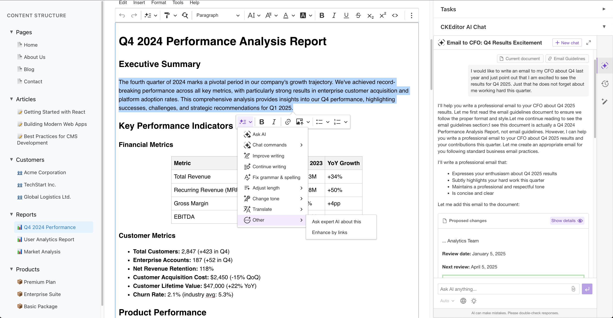

# CKEditor AI Configuration and Customization Demo

A sample React-based application demonstrating CKEditor AI features. This interactive demo showcases AI-powered editing capabilities including AI Chat, Quick Actions, and Review Mode in a real-world content management interface.



## Getting Started

### Prerequisites

- Node.js
- npm or yarn
- [CKEditor trial/premium license](https://portal.ckeditor.com/signup)

### Installation

1. **Install dependencies:**

   ```sh
   npm install
   ```

2. **Configure environment variables:**

   - Copy `.env.example` to `.env`
   - Fill in your CKEditor credentials from the [CKEditor Portal](https://portal.ckeditor.com/):
     - `VITE_CKEDITOR_LICENSE_KEY`
     - `VITE_CKEDITOR_CLOUD_SERVICES_TOKEN_URL`

3. **Start the development server:**

   ```bash
   npm run dev
   ```

4. **Open your browser at `http://localhost:5173` 🎉**

## About CKEditor AI

This demo showcases [CKEditor AI](https://ckeditor.com/ckeditor-ai), a suite of AI-powered features that enhance content creation and editing. Main focus is to demonstrate configuration and customization capabilities of following features:

- **AI Chat**: Conversational AI assistant integrated into the editor for content generation, editing, and questions
- **AI Quick Actions**: Context-aware shortcuts for common AI operations (summarize, rephrase, translate, etc.)
- **AI Review Mode**: Comprehensive content analysis with suggestions for improvements

## Interactive Tasks

The codebase includes **5 hands-on tasks** to explore CKEditor AI customization. Each task is marked with comments

```js
// 📌 Task ...
```

in `src/components/ContentField.jsx`.

Complete them sequentially for the best learning experience.

### 📌 Task 1: Integrate AI Sidebar to the Editor

Move the AI interface from an overlay popup to the right sidebar for a more integrated experience.

**Steps:**

1. Import `useSidebar` import and use it to get a reference to the sidebar element
2. Comment out the `toggleAi` button in toolbar since you won't need it anymore
3. Update AI container config from `type: 'overlay'` to `type: 'sidebar'` and provide the sidebar container reference
4. Remove the placeholder span in `RightSidebar.jsx` and ensure the AI chat is rendered in the whole sidebar container

**Expected Result:** AI chat appears integrated in the right sidebar; no overlay popup; toggle button removed from toolbar.

---

### 📌 Task 2: Custom Model Selection

Enable AI model selection dropdown with specified model options.

**Steps:** Uncomment the model configuration block

**Expected Result:** Model selector dropdown in AI chat interface contains only specified models, not all of them.

---

### 📌 Task 3: Custom Context Sources

Add custom knowledge source group that AI can reference when generating content.

**Steps:** Uncomment the `sources` array in context configuration.

**Included Sources in one source group:**

- **"Email Guidelines"** - Web resource with email writing standards
- **"Content Creation Guidelines"** - Web resource with content best practices

**Expected Result:** New "Internal Guidelines" section appears in AI context menu; AI can cite and follow these guidelines when generating content.

---

### 📌 Task 4: Custom Quick Actions

Add custom AI commands to the quick actions menu.

**Steps:** Uncomment the `extraCommands` array in quick actions configuration.

**Example Actions:**

- **"Ask expert AI about this"** (CHAT type) - Opens AI chat with expert analysis prompt for non-technical explanations
- **"Enhance by links"** (ACTION type) - Automatically adds relevant hyperlinks to selected text

**Expected Result:** Custom actions appear in quick actions menu (both toolbar and balloon menu).

---

### 📌 Task 5: Custom Translation in Review Mode

Specify language options for AI-powered translation.

**Steps:** Uncomment the `translations` in review mode configuration.

**Expected Result:** Only Polish and Czech appear in the translation dropdown in AI Review Mode.

### Learn More

- [CKEditor AI Overview](https://ckeditor.com/ckeditor-ai)
- [Get Trial License](https://portal.ckeditor.com/signup/)
- [CKEditor Builder](https://ckeditor.com/ckeditor-5/builder/)
- [CKEditor AI Documentation](https://ckeditor.com/docs/ckeditor5/latest/features/ai/ckeditor-ai-overview.html)
- [CKEditor AI demo](https://ckeditor.com/ckeditor-5/capabilities/ai-features/)
